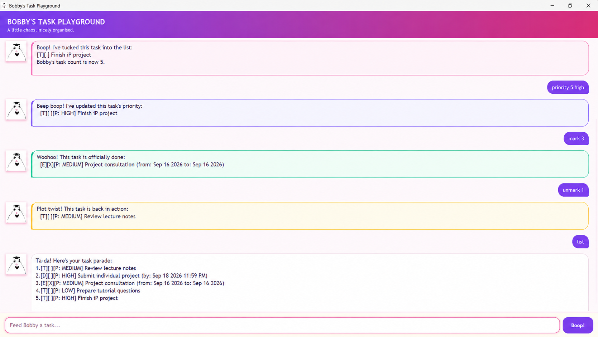

# Bobby

Bobby is a cheerfully goofy desktop task manager for tracking to-dos,
deadlines, and events through simple text commands.



## User guide

The [Bobby User Guide](https://seahjiale.github.io/ip/) explains every command,
accepted input format, and common input error.

## Developer setup

Bobby requires JDK 25 and uses Gradle for building and testing.

1. Clone the repository.
2. Open the project root in IntelliJ IDEA.
3. Configure the project SDK and Gradle JVM to use JDK 25.
4. Run `bobby.Launcher` to start the JavaFX interface.

Keep `src/main/java` as the Java source root so Gradle and IntelliJ can locate
the application classes correctly.

## Build and test

On Windows, run:

```powershell
.\gradlew.bat clean check
```

On macOS or Linux, run:

```bash
./gradlew clean check
```

The `check` task compiles Bobby, runs the JUnit suite, applies Checkstyle, and
verifies the configured JaCoCo coverage thresholds.

## Create the executable JAR

Build Bobby's cross-platform fat JAR with:

```powershell
.\gradlew.bat clean shadowJar
```

Gradle creates `build/libs/bobby.jar`. Run it using Java 25:

```powershell
java -jar .\build\libs\bobby.jar
```
